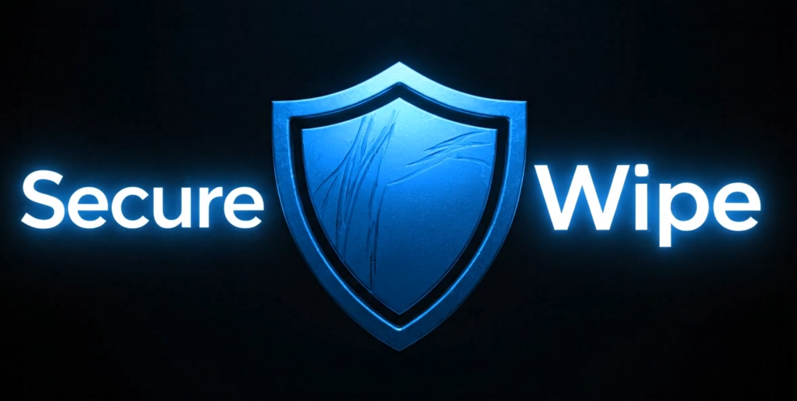

<html>

<article>

<h1>SecureWipe 🛡️</h1>

<strong>Secure Data Wiping for a Trustworthy IT Asset Circular Economy.</strong>
 
<em>A project by Team CodeHex for the Smart India Hackathon 2025.</em>

 

 

 
 <a href="https://secure-wipe.vercel.app/"><strong>Explore the Live Dashboard »</strong></a>

        <h2>📄 Introduction</h2>
        

            India's escalating e-waste crisis, intensified by data security fears, hinders IT asset recycling and locks away significant economic value. SecureWipe offers a robust solution: a USB-driven tool utilizing a lightweight OS and Python scripts to perform strong, NIST-compliant data erasure by overwriting device storage. To ensure complete trust and compliance, it generates a verifiable status report. This user-friendly, plug-and-play system builds confidence among individuals and enterprises, promoting the responsible disposal and reuse of electronics.
        

        <h2>✨ Key Features</h2>
        <ul>
            <li><strong>🛡️ Remote Wipe Command:</strong> Trigger a secure data wipe from a simple, elegant web dashboard.</li>
            <li><strong>💻 USB-Driven Agent:</strong> A bootable Linux agent (using Linux Mint) bypasses the host OS for direct hardware access.</li>
            <li><strong>⚙️ NIST-Compliant Erasure:</strong> Uses the <code>shred</code> utility to perform overwrites, making data forensically unrecoverable.</li>
            <li><strong>🌗 Light/Dark Mode:</strong> A sleek, user-friendly interface with a theme toggle.</li>
            <li><strong>📄 Multi-Page Experience:</strong> A complete landing page, dashboard, and "How It Works" section.</li>
            <li><strong>☁️ Scalable Architecture:</strong> Deployed on modern cloud platforms (Vercel & Render) for reliability.</li>
        </ul>
        

        <h2>🚀 Getting Started & Installation</h2>
        

            You can run this project locally by cloning the repository and setting up the components.
        

        <ol>
            <li>
                <strong>Clone the repository:</strong>
                <pre><code>git clone https://github.com/your-username/securewipe.git</code></pre>
            </li>
            <li>
                <strong>Navigate to the Backend directory:</strong>
                <pre><code>cd securewipe/backend</code></pre>
            </li>
            <li>
                <strong>Install the required backend libraries:</strong>
                <pre><code>pip install -r requirements.txt</code></pre>
            </li>
             <li>
                <strong>Run the backend server:</strong>
                <pre><code>python server.py</code></pre>
            </li>
        </ol>
        

        <h2>💡 Usage</h2>
        
<strong>Frontend:</strong>

        
Simply open the <code>index.html</code> file from the <code>frontend</code> folder in your browser. If running the backend locally, ensure you update the <code>SERVER_URL</code> in <code>script.js</code>.

        
<strong>Agent Usage Example:</strong>

        <ol>
            <li>Boot the target computer using your Linux Mint USB.</li>
            <li>Open a Terminal and navigate to the <code>agent</code> folder.</li>
            <li>Create a test file to wipe: <pre><code>echo "This is a test file for SecureWipe" > wipe_me.txt</code></pre></li>
            <li>Run the agent. It will register with the server and wait for commands: <pre><code>python3 wipe_agent.py</code></pre></li>
            <li>Navigate to the web dashboard, find your device, and click "WIPE".</li>
        </ol>
        

        <h2>💻 Technology Stack</h2>
        

          
          
          
          
          
          
          
          
          
        

        

        <h2>👥 Team Members</h2>
        

          

            <a href="https://github.com/ismailali025"><strong>Ismail Ali</strong></a>
            &nbsp;&nbsp;&nbsp;|&nbsp;&nbsp;&nbsp;
            <a href="https://github.com/KHADERSHAREEF19"><strong>Khader Shareef</strong></a>
            &nbsp;&nbsp;&nbsp;|&nbsp;&nbsp;&nbsp;
            <a href="https://github.com/hydxr"><strong>Hyder Siddiqui</strong></a>
          

          

            <a href="https://github.com/SyedAther-ali"><strong>Ather Ali</strong></a>
            &nbsp;&nbsp;&nbsp;|&nbsp;&nbsp;&nbsp;
            <a href="https://github.com/Shreya242005"><strong>Shreya Tadakala</strong></a>
            &nbsp;&nbsp;&nbsp;|&nbsp;&nbsp;&nbsp;
            <a href="https://github.com/aliasyeda"><strong>Alia Samia</strong></a>
          

        

    </article>
    <footer>
        

    </footer>
</html>
